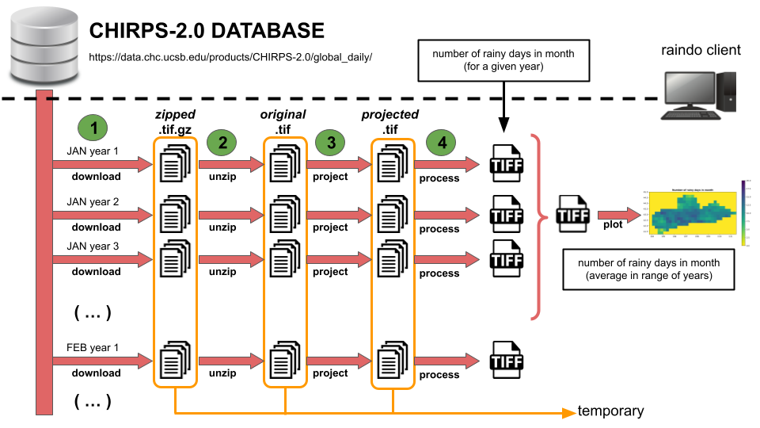
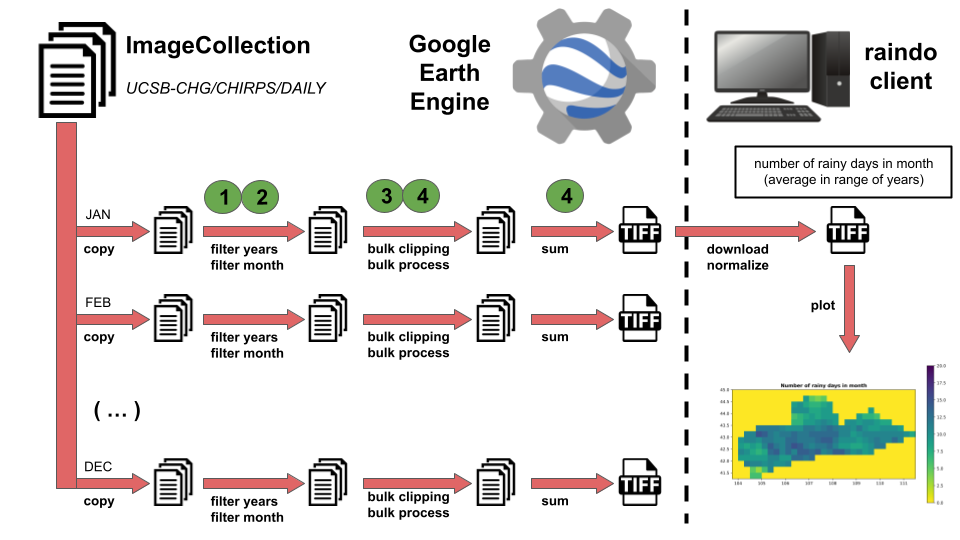

# RAIN DO

Utility program to extract the monthly average of number of rainy days per
month, in the past years of data available, for a given area of interest,
from the CHIRPS dataset (https://www.chc.ucsb.edu/data/chirps).
The outputs are 12 rasters (one per month) of the same coverage as the area
of interest, displaying the number of rainy days per month as an integer
The are of interest has to be provided as a `.shp` file, and you can use
the data in `example/aoi` for trying out the code.


The code can use Google Earth Engine (https://code.earthengine.google.com)
through its Python API to pre-process the rain data to "number of rainy
days per month", but this requires a Google Earth Engine account.
Alternatively, it can also use the local resources to perform all the
calculations (see the section below for each case).

The program comes with a command line utility which should be ready to use
from the terminal:

```console
raindo --help
```

It can be installed in any python environment just like any other python
package using pip or similar tools.
However, note that some of the python dependencies of the program require
some extra system packages available in the environment (such as `gdal`
or `libgdal-dev`).

```console
pip install -e raindo
```

To further help with the issue of system dependencies, the package also
includes a Dockerfile that can build an image with all the necessary ones
already installed.
In order to use it, one must first build the image and then use it to run
a container.

In linux systems, the image can be build by running:

```console
docker build -t raindo-image .
```

And the container can be run with:

```console
docker run --rm -it -p 8888:8888 --mount type=bind,source="$(pwd)"/data,target=/root/data --name raindo-container raindo-image
```

It is important to note that the `data` folder should be an existent folder
in the current directory, (otherwise make it or adapt the command).
This is being mounted on the container for data persistence and easier
access to the outputs.

Moreover, the command attaches the port `8888` because it also launches a
jupyter-lab server on startup.
To access the container through that interface, one only needs to copy paste
the final output received when the container was ran into any web explorer.

```console
% docker run --rm -it -p 8888:8888 -v data_vol:/root/data --name raindo-container raindo-image

(...)

[C 2022-06-26 21:42:43.362 ServerApp] 
    
    To access the server, open this file in a browser:
        file:///root/.local/share/jupyter/runtime/jpserver-1-open.html
    Or copy and paste one of these URLs:
        http://25978f91276f:8888/lab?token=ab660086784d1318bdeaa2fdbc011373ff1875c534250674
     or http://127.0.0.1:8888/lab?token=ab660086784d1318bdeaa2fdbc011373ff1875c534250674
```

The container can also be accessed by running:

```console
docker exec -it raindo-container /bin/bash
```

This should open a terminal inside of it, with a virtual environment already
loaded in, and ready to use the `raindo` command line interface (see below
in the usage section).


## Local Processing

The local processing version will download the source files directly from the
[CHIRPS-v2.0](https://data.chc.ucsb.edu/products/CHIRPS-2.0/global_daily/)
online data server and perform all calculations locally.
This is somewhat expensive as downloading the datafiles corresponding to each
day of each year takes some time, so consider using the GEE option below if
you have an access account.

The subcommand to use this feature is:

```console
raindo local --miny 2010 --maxy 2020 --aoi ./aoi/aoi.shp
```

As indicated in the call, it requires the user to pass an initial year, a
final year (whose data will be included in the calculation) and the path
to the file with the area of interest.
If these 3 required parameters are not provided the user will be prompted
for them, but there will be defaults already set in (the defaults are the
same as the ones used above).

### Data Acquisition Pipeline

The way the program works, it will process each of the months separatedly.
It will first generate the `.tif` files with the total number of rainy days
in the month for each year, then calculate the average from those into an
output `.tif` file and finally plot it.
To generate each of those year-month `.tif` files, it will perform the
following actions sequentially for each day in that period:

1. Download the *zipped* `.tif` files from the
[CHIRPS-v2.0](https://data.chc.ucsb.edu/products/CHIRPS-2.0/global_daily/)
online data server.
2. Unzip it into a raw *original* `.tif` file.
3. Project it using the area of interested into a *projected* `.tif` file.
4. Process it to identify in which sectors of the image there was any
precipitation registered.

The last step (4) does not save the data into any output, as it is instead
accumulated in memory until the whole period is processed and the output
with the total number of rainy days is written to a file.
These files are then permanently stored in a folder that can be specified
with the `--dir-dat` command line option (`./chirps_dat` by default, which
will be created if it doesn't already exist).
Subdirectories are created for each year.

All the intermediate files (*zipped*, *original* and *projected* `.tif`s)
are deleted as they are used in order to prevent the excessive usage of
disk space, but there are command line options that allow the user to keep
them for further manual processing (see options `--keep-tgzs`, `--keep-tifs`
and `--keep-proj` respectively).
They are kept inside a folder that can be specified with the `--dir-tmp`
command line option (`./chirps_tmp` by default, which will be created if
it doesn't already exist).

Once all the files with the total number of rainy days for each year has been
created, they are averaged into the final TIF file for that month and the
raster is plotted.
Both these files are stored into a folder that can be specified with the
`--dir-out` command line option (`./chirps_out` by default, which will be
created if it doesn't already exist).
Subdirectories are created for each year range.



Upon repeated calls of the program, it will automatically re-generate the
averages and re-plot the data using any existing monthly `.tif` file that
already exists for the period of years considered without going to the
process of downloading and processing each day again.
Moreover, if you permanently kept any of the intermediate files, each of
the substeps 1-3 is executed only if the output of that step is missing,
checking in reverse order (so you may need to delete these manually if
you want to force them to be re-calculated).

Note that, by default, the program will generate the plot for each month
separatedly and adapt the range of the color map specifically for the max
number of days of that month.
This optimizes the aesthetics for each monthly raster but makes them more
difficult to compare to one another.
However, once the data acquisition has been ran once, the plotting step can
be quickly repeated from the stored `.tif` files with the accumulated data
and the option `--scale-max` passed so that it will use the same scale in
all plots.

Finally, the code will use low-resolution data by default due to the time
it takes for the files to download, but higher resolution data can be
requested by using the `--data-resolution` option.
The default is `p25` (grid points every 0.25 degress), which can be changed
to `p05` (grid points every 0.05 degress).

## Earth Engine Processing

This second processing version will perform most of the operations in the
Google Earth Engine server and directly download the final `./tif` files
with the average number of rainy days for each month.
It is significantly faster than the previous option, allowing for better
resolutions, and scales better with the number of years to be considered.
The only drawback is that the user needs a GEE service account.

The usage for this option is as follows:

```console
raindo geesrv --miny 1981 --maxy 2020 --aoi ./aoi/aoi.shp --gee-cred ./gee_cred.json
```

Most of the options are the same as in the `local` subcommand (noting that
the default for `miny` is different), but to use GEE you also need to pass
the file containing the credentials to your account.
For more information on how to create service accounts, create private key
files, and registering your account to Earth Engine, please visit the
Google Earth Engine
[documentation page](https://developers.google.com/earth-engine/guides/service_account).

### Data Acquisition Pipeline

In this case the pipeline is slightly different.
Inside the server, the code creates an object that contains all the
precipitation rasters for every year and every month (`ImageCollection`)
and performs most operations on it.
More specifically, it will perform the following operations for each month:

1. Filtering out the data beyond the year range selected.
2. Filtering out the data from other months.
3. Clip the data to the region corresponding to the area of interest.
4. Process it to identify in which sectors of the image there was any
precipitation registered.
5. Aggregate all the data into a single image with total number of rainy
days for the month and period considered.

This last file is downloaded to the host and normalized by the number
of years to obtain the final `.tif` file with the average number of
rainy days.
As in the other case, a raster plot file is generated and both files
are stored in the directory specified with the `--dir-out` option in
the same way (also defaulting to `./chirps_out`).



Note that in this case there are no intermediate files, so different year
ranges will have to be calculated from scratch even if the user already
calculated ranges with overlapping years.
Re-plotting from the final `.tif` files however is automatically, and the
same clarification for the `--scale-max` max option applies.

The resolution criteria used by GEE however is different, and so instead
of a set of discrete `p25`/`p05` options, one can select any number to
be used as the separation in meters between gridpoints.
It still uses the
[CHIRPS-v2.0](https://data.chc.ucsb.edu/products/CHIRPS-2.0/global_daily/)
dataset so very low values that would go below the `p05` precision don't
actually contain any extra data but interpolations instead.
Moreover, the more fine the gris is, the heavier the file to download, and
since google has a limit on the size of file it allows to download in this
way, no resolution lower than 500 is permitted.
